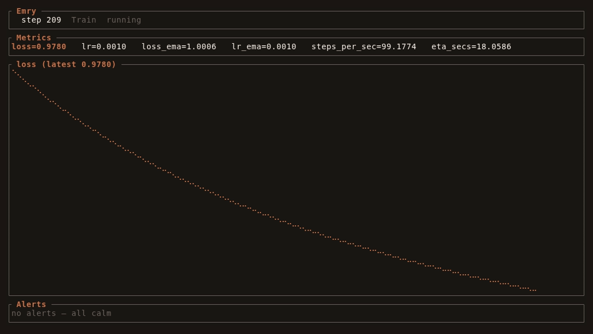
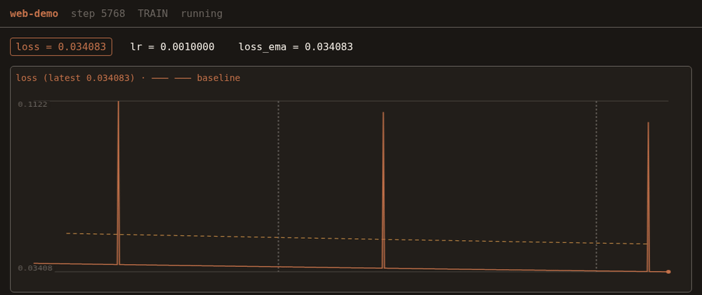

# Emry

**Gentle observability for long training runs.**

Emry watches your training run the way you'd want a good colleague to: quietly,
without ever getting in the way. A training loop calls `run.emit()`; metrics
flow through a lock-free ring into an event-sourced engine that persists an
append-only log and serves a live dashboard. No accounts, no phone-home — just
your metrics, on your machine, in a file you can read.



<sub>The terminal dashboard (`emry watch`) — live loss curve, metric cards,
phase, and alerts.</sub>



<sub>The self-hosted web dashboard (`emry web`) — live chart with a dashed
baseline overlay for run comparison, phase bands, and checkpoint markers. No
CDN; works air-gapped.</sub>

- **Stays out of the way.** `emit()` targets well under 10 µs amortized (tens of
  nanoseconds in our benchmarks) and never blocks the training thread — every
  queue is bounded and drops-and-counts under load, so observability can never
  harm the run.
- **Event-sourced.** An append-only `events.jsonl` is the audit trail; a wide
  `metrics.jsonl` is plain JSONL you can read with `jq`, pandas, or anything.
- **Observe live or after the fact.** A terminal dashboard, a self-hosted web
  dashboard (no CDN — air-gap friendly), or just tail the files.
- **Built for clusters.** Embedded, sidecar, or file modes; auto-detects
  SSH/SLURM. The training process survives an engine crash.

## Install

```bash
pip install emry
```

## Quickstart

Your training loop calls `emry.run(...)` and `run.emit(...)`. That's it:

```python
import emry

with emry.run("llama-sft", config={"lr": 2e-5}, metrics=["loss", "lr"]) as run:
    for step in run.steps(10_000):
        loss = train_step()
        run.emit(loss=loss, lr=scheduler.get_last_lr()[0])
```

`run.steps(n)` yields steps and advances Emry's step counter for you; `emit()`
takes any metrics as keyword arguments. Mark phases with
`run.phase = emry.Phase.EVAL`, and iterate epochs with `run.epochs(n)` to track
the epoch automatically. Values are duck-typed — tensors and numpy scalars are
coerced, so you can pass `loss` directly without `.item()`.

By default Emry writes a run directory under `./logs/` and, when attached to a
TTY, brings up the live terminal dashboard. Set `EMRY_MODE` (`embedded` |
`sidecar` | `file`) to control how it runs, or observe any run after the fact
with the commands below.

## Observe a run

```bash
emry runs                         # list runs under ./logs
emry watch ./logs/llama-sft_…     # live terminal dashboard
emry web   --run-dir ./logs/…     # live web dashboard at http://127.0.0.1:8787
emry compare run_a/ run_b/        # final metrics side by side
emry export csv --run-dir ./logs/… --output history.csv
```

On a cluster, run the engine as a sidecar so observability outlives the training
process — see the [SLURM runbook](docs/emry/slurm.md).

## Documentation

- [SLURM / sidecar runbook](docs/emry/slurm.md) — login-node-observe + on-node
  sidecar engine.
- [Migration guide](docs/emry/migration.md) — the `metrics.jsonl` schema and
  importing history from other loggers.

## Development

### Prerequisites

- Rust 1.87+ (`rust-toolchain.toml` pins the toolchain)
- `llvm-tools-preview` for coverage: `rustup component add llvm-tools-preview`
- `cargo-llvm-cov`: `cargo install cargo-llvm-cov`
- Python 3.10+

### Commands

```bash
# Full local CI (fmt, clippy, test, ≥90% coverage)
./scripts/pre-commit-rust.sh

# Coverage only
./scripts/check-coverage.sh

# Python tests
pip install -e ".[dev]"
pytest

# Build the native extension locally (maturin)
pip install maturin && maturin develop

# Run the demos
cargo run -p emry-tui --example tui_demo
cargo run -p emry-web --example web_demo   # http://127.0.0.1:8788
```

### Pre-commit

```bash
pip install pre-commit
pre-commit install
```

Hooks run: trailing whitespace, YAML/TOML checks, then `./scripts/pre-commit-rust.sh`
(fmt + clippy + test + **90% line coverage gate**).

### Quality bar

| Check | Threshold |
|-------|-----------|
| `cargo clippy` | `-D warnings` (pedantic) |
| Rust line coverage | **≥ 90%** (workspace) |
| Python line coverage | **≥ 90%** (`pytest --cov-fail-under=90`) |

## License

Apache License 2.0 — see [LICENSE](LICENSE).
